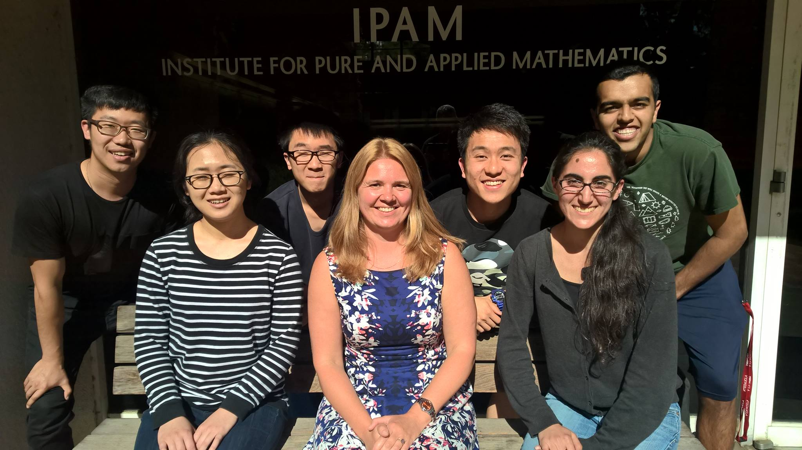
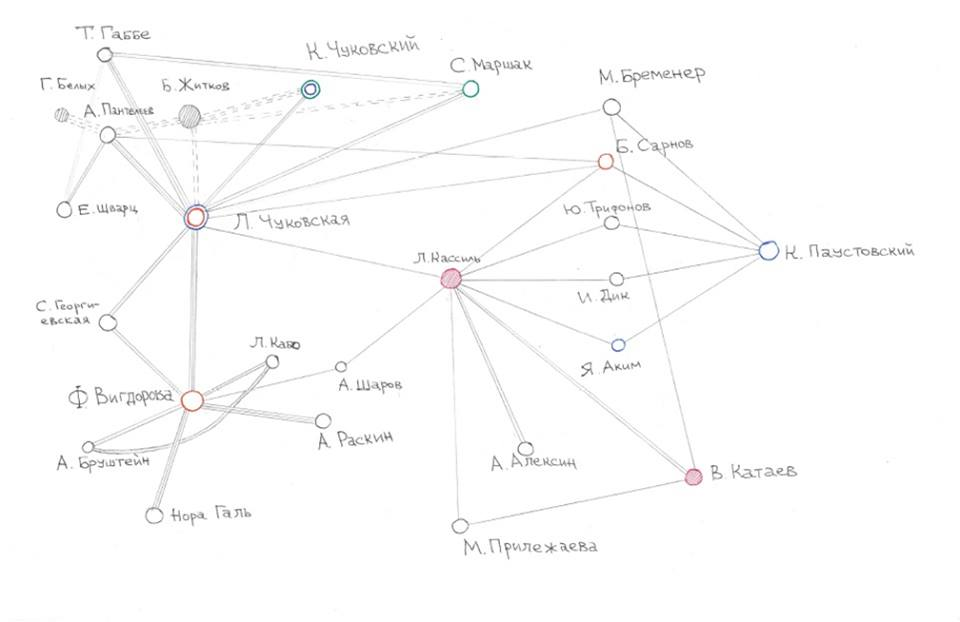
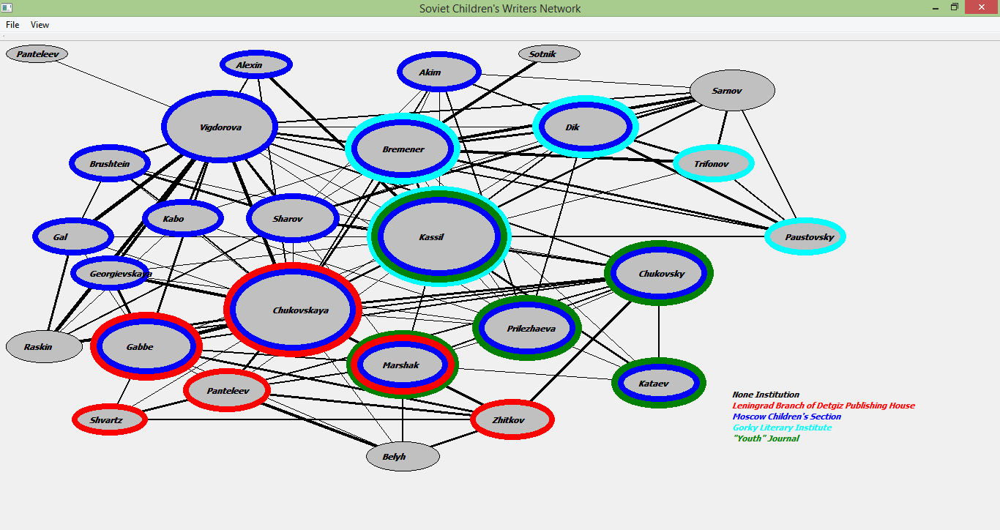
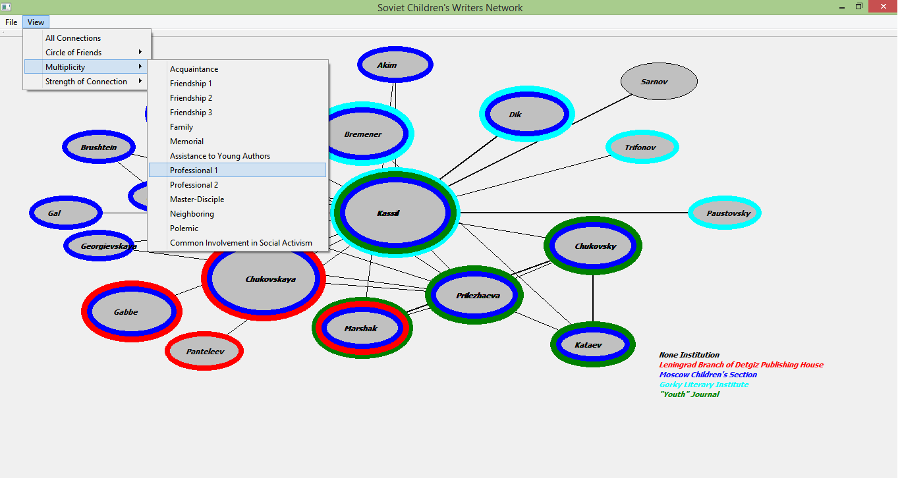
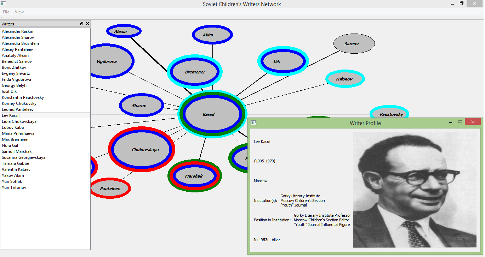
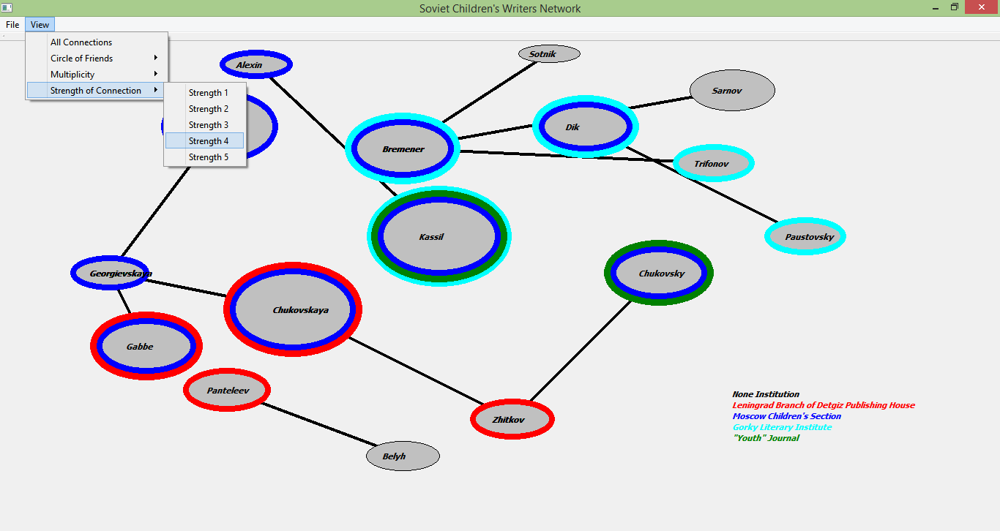
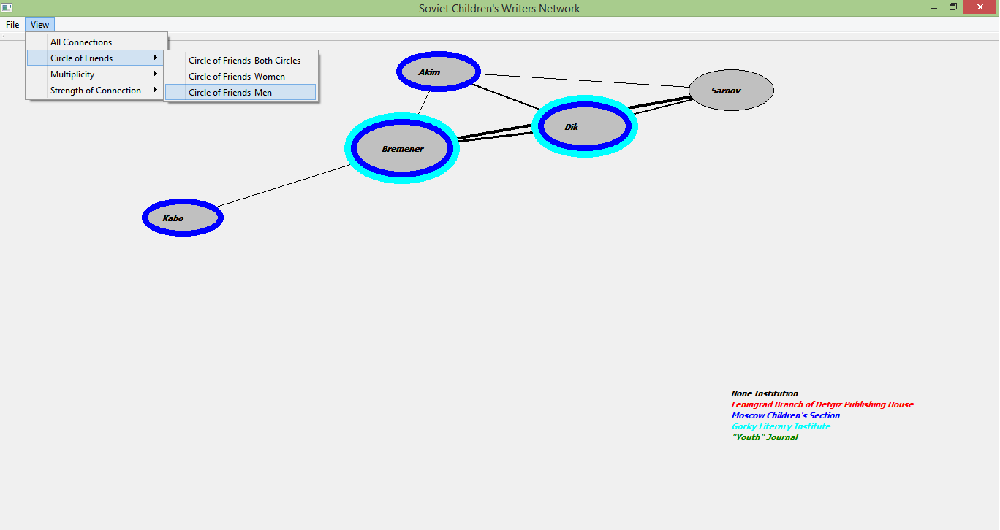

# Soviet Writers's Social Network

I created this project for a researcher, [Ekaterina Lapina-Kratasyuk](https://www.hse.ru/en/org/persons/11730611), who works in [Institute for Pure and Applied Mathematics (IPAM)](http://www.ipam.ucla.edu/) at [Universit of California, Los Angeles (UCLA)](http://www.ucla.edu/), with Samir Patel, Natalia Kazimi, [Wei Dai](https://www.linkedin.com/in/weidai1994/), Stephen Wu, Jin An, directed by Prof. [Stephen DeSalvo](https://sites.google.com/site/stephendesalvo/) in Advanced Programming during Spring 2016.

## Background

This scheme represents interactions and ties between the Soviet children’s writers between 1953-1956. It would make evident how the considerable liberation in this field took place, and how personal efforts and interpersonal ties influenced it. It is highly important when describing the so called process of desalinization in Soviet culture. Till now this process has been described mostly by means of generalizing concepts and even cultural myths, despite we have enough data to attentively analyze it focusing on minor details and modes of interactions.

## Description

Ekaterina would like to visualize the data, the number of ties one node has is directly designated by the size of the circle with strength and length. The major strength of the tie is designated by the “5th” degree whereas the weakest is designated by the 1st. As for the length, designated by “1” the direct tie between two persons and increase the degree in correspondence with the number of intermediaries which provide this tie.

There are four major nodes, for these four classes of nodes should be represented with particular color or shape:

- a) people who played crucial role in institutional interactions (they are Lev Kassil and Valentin Kataev)
- b) people who were important as cultural referees (they are Samuil Marshak and Korney Chukovsky)
- c) people who were very socially active (they are Lidia Chukovskaya and Frida Vigdorova)
- d) people who were both aesthetically and ideologically influential (I would list here both Chukovskaya and Paustovsky)

For more details about [background](./data/Backgroud.pdf)

**Handwriting Version**

## Visualization

We are creating a method of visualization for connections between Soviet children’s writers. Each writer will be depicted by a shape in the web. All individuals are circles unless they are part of a specific node in which case they will be represented by a square. There are 4 nodes which represent people who played crucial roles in institutional interactions, people who were cultural referees, people who were very socially active, and people who were aesthetically and ideologically influential. Each node contains two people and their specific node will be visible by hovering the mouse over their square. Individuals with a connection will have a line drawn between their shapes and the thickness of the line will indicate the strength of the tie. Individuals that are deceased will have an X over their shape. To show membership in an institution, the shape of an individual will be a certain color. The institutions included are Gorky Literary Institute, “Youth” Journal, the Leningrad branch of the editorial of the “Detgiz” publishing house, and the Moscow Bureau of the Children’s Section of the Writers’ Union. Individuals with a specifically noted position within an institution will have a ring around their shape and their position will be shown by hovering the mouse over their shape.

To make this model editable we will create a series of menus that allow the researchers to add individuals to the web and edit the information of individuals already in the web. The Modify Graph window will be accessible by clicking the QPushButton on the side of the web visualization. This window will contain three QPushButton options: Add, Erase, and Edit. For more details of [operation](./data/Operation.pdf)

## Windows

**Main Window**

**Multiplicity Professional 1 Window**

**Select Writers Window**

**Strength Window**

**Circle of Friends Window**

